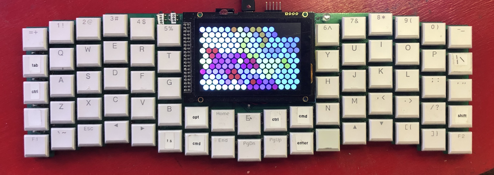
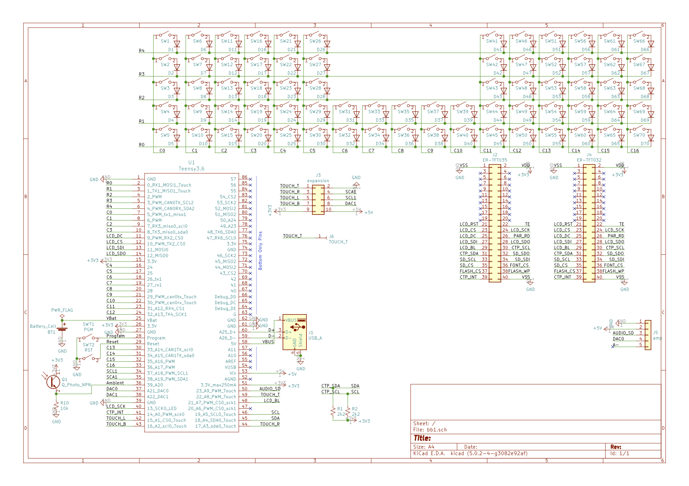
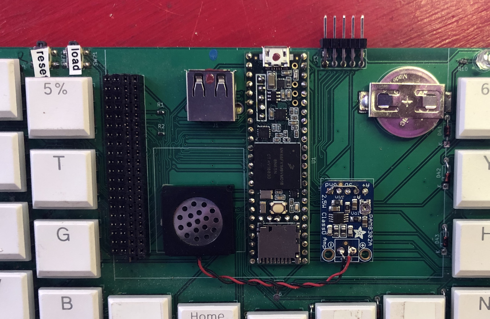
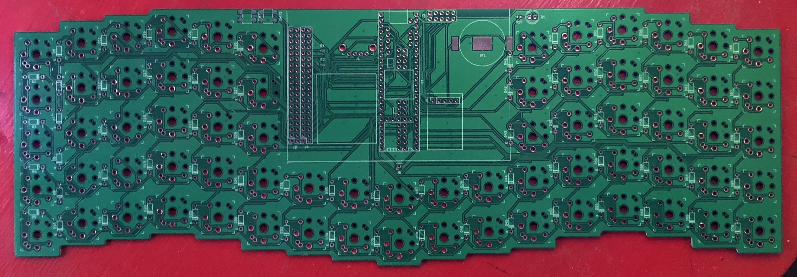
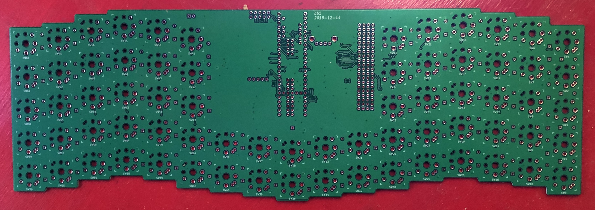

# briteboard

BriteBoard is a Teensy 3.6-based keyboard with:

- 5x14 key matrix
- LCD display with capacitive touchscreen
- Audio amplifier and speaker
- USB host port for external mouse or keyboard
- Ambient light sensor

Runs the [britepad](https://github.com/blackketter/britepad) software.

